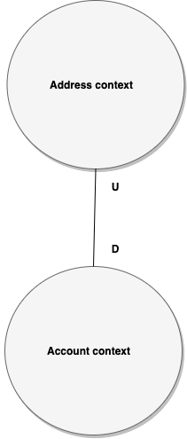
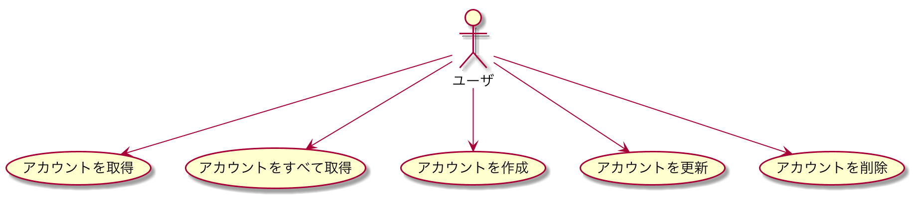
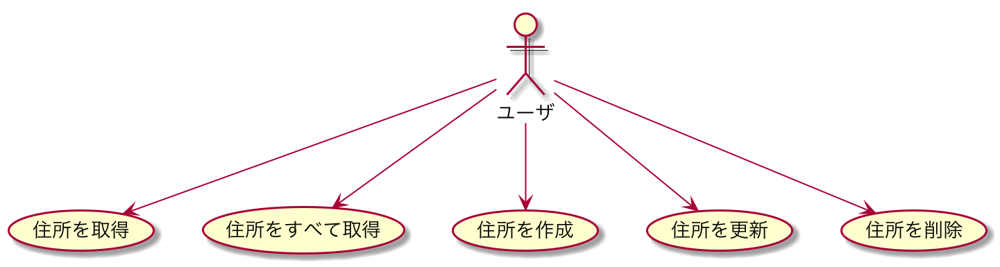

# kotlin-ddd-sample

This is a DDD sample using Kotlin.

Modeled using Amazon's account function as a theme.

- [Spring Boot](https://github.com/spring-projects/spring-boot)
- [Exposed](https://github.com/JetBrains/Exposed)
- [H2 Database](https://github.com/h2database/h2database)

## Run Application

### Account
``` bash
$ ./gradlew account:bootRun
```

### Address
``` bash
$ ./gradlew address:bootRun
```

## API

### Account
http://localhost:8080/swagger-ui.html

### Address
http://localhost:8081/swagger-ui.html

## Domain-driven design

### Context map



### Use case





### Language

#### Account

| japanese | english |
| ---- | ------ |
| アカウント | account |
| アカウントのID | account id |
| アカウントの氏名または会社名 | name |
| アカウントの発音 | name pronunciation |
| アカウントのメールアドレス | email |
| アカウントのパスワード | password |
| アカウントの住所 | account address |
| アカウントの住所のID | account address id |
| アカウントの住所録 | address book |
 
#### Address

| japanese | english |
| ---- | ------ |
| 住所 | address |
| 住所の氏名または会社名 | full name |
| 住所の郵便番号 | zip code |
| 住所の都道府県 | state or region |
| 住所の住所欄1 | line1 |
| 住所の住所欄2 | line2 |
| 住所の電話番号 | phone number |
| 住所の電話番号 | phone number |
| 住所の持ち主 | owner |
| 住所の持ち主のID | owner id |
